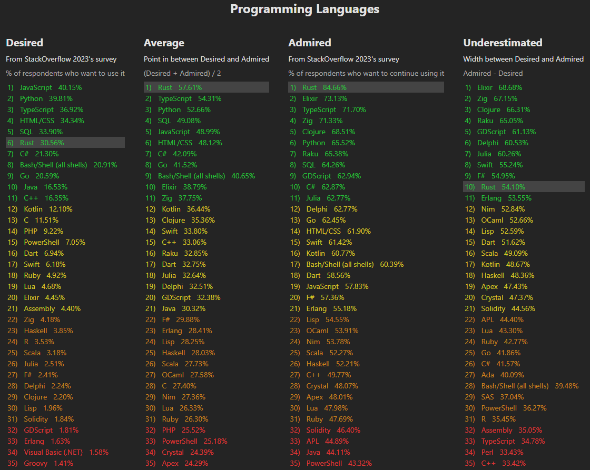

# Better stats for StackOverflow 2023's survey

The well known [2023 Developer Survey](https://survey.stackoverflow.co/2023/#technology-admired-and-desired) of Stackoverflow is incredible, very interesting and its results are valueable since there's over 89000 respondents.

However, in the `Technology` > `Admired and Desired` part, it is not possible to sort technologies by the most `Admired` one, nor by the average between `Desired` and `Admired`, nor by the largest width between `Desired` and `Admired`.

**It's to browse those statistics that I built this simple Svelte display.**

The raw results, with the others statistics calculated, are displayed in JSON at the bottom of the web page.

[Browse statistics](https://mariovieilledent.github.io/)

